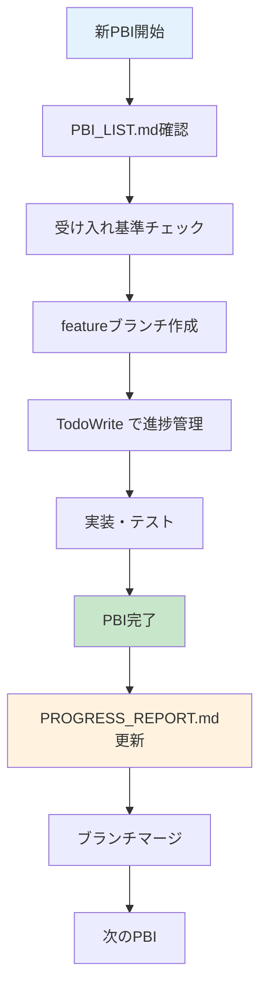
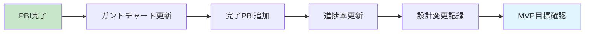
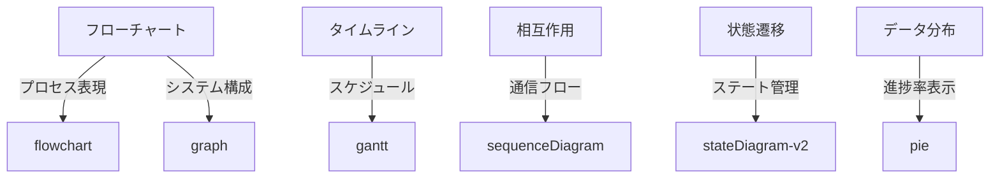
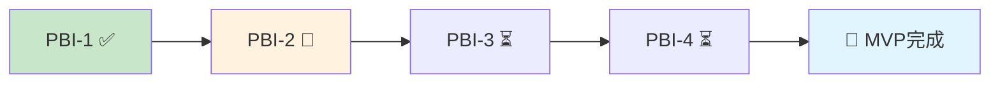

# Claude Code 開発ルール & ガイドライン

## 📋 開発フロー

### 🔄 PBI 開発サイクル



## 📚 ドキュメント管理規則

### 📄 各ファイルの役割

| ファイル名           | 役割                       | 更新タイミング   | 信頼度      |
| -------------------- | -------------------------- | ---------------- | ----------- |
| `PBI_LIST.md`        | PBI 仕様書・受け入れ基準   | PBI 追加・変更時 | 📋 仕様     |
| `PROGRESS_REPORT.md` | **唯一の信頼できる情報源** | PBI 完了後・週次 | 🎯 **最高** |
| `CLAUDE.md`          | 開発ルール・ガイドライン   | ルール変更時     | 📖 規約     |

### 🎯 PROGRESS_REPORT.md 更新ルール



## 🛠️ 開発フロー詳細

### 1️⃣ PBI 着手前

```bash
# 1. PBI_LIST.mdで詳細確認
- [ ] 受け入れ基準を全て理解
- [ ] ストーリーポイント確認
- [ ] 技術的制約確認

# 2. featureブランチ作成
git checkout develop
git pull origin develop
git checkout -b feature/PBI-X-description
```

### 2️⃣ 開発中

```bash
# 3. TodoWriteで進捗管理
- [ ] 実装タスクを分解
- [ ] 1つずつin_progressにして作業
- [ ] 完了したらすぐにcompletedに更新
```

### 3️⃣ PBI 完了後

```bash
# 4. PROGRESS_REPORT.md更新
- [ ] 完了PBIセクション追加
- [ ] ガントチャート進捗更新
- [ ] 円グラフ進捗率更新
- [ ] 設計変更があれば履歴追加

# 5. ブランチマージ
git add .
git commit -m "feat: PBI-X implementation"
git checkout develop
git merge feature/PBI-X-description
git branch -d feature/PBI-X-description
```

## 🎨 Mermaid 図表ガイドライン

### 使用する図表タイプ



### 色彩ルール

| 状態   | 色コード  | 説明                |
| ------ | --------- | ------------------- |
| 完了   | `#c8e6c9` | 緑系 - 成功・完了   |
| 進行中 | `#fff3e0` | オレンジ系 - 作業中 |
| 未着手 | `#f5f5f5` | グレー系 - 待機中   |
| エラー | `#ffcdd2` | 赤系 - 問題・削除   |
| 重要   | `#e1f5fe` | 青系 - 注目・目標   |

## 🚀 コミットメッセージルール

### フォーマット

```
<type>: <description>

```

### Type 一覧

| Type       | 説明             | 例                                  |
| ---------- | ---------------- | ----------------------------------- |
| `feat`     | 新機能追加       | `feat: PBI-2 LLM通信機能実装`       |
| `fix`      | バグ修正         | `fix: ファイル読み込みエラー修正`   |
| `docs`     | ドキュメント更新 | `docs: PROGRESS_REPORT.md更新`      |
| `refactor` | リファクタリング | `refactor: LLM通信処理の最適化`     |
| `test`     | テスト追加・修正 | `test: LLM通信のユニットテスト追加` |

## 🧪 テスト・品質管理

### 各 PBI 完了時の確認項目

```bash
# コンパイル・リント確認
npm run compile
npm run lint

# 手動テスト
- [ ] 基本機能動作確認
- [ ] エラーケース確認
- [ ] パフォーマンス確認

# ドキュメント更新
- [ ] PROGRESS_REPORT.md更新
- [ ] 必要に応じてREADME.md更新
```

## 💡 設計原則

### 開発哲学

1. **シンプルさ優先** - 複雑な実装より理解しやすい実装
2. **ユーザー体験重視** - 技術的制約よりユーザビリティ
3. **段階的改善** - 完璧より動く最小限実装
4. **可視化重視** - 進捗・状態は必ず可視化

### 技術選択基準

1. **LLM 活用** - パーサーより生成 AI 活用
2. **VSCode 標準** - カスタムライブラリより標準 API
3. **保守性優先** - 短期効率より長期保守性

## 🎯 MVP 定義

### MVP 完成条件



### MVP 機能要件

- [x] ファイル解析ボタン
- [ ] LLM 通信機能
- [ ] 変数辞書表示
- [ ] エラーハンドリング

---

## 📞 緊急時対応

### 問題発生時の対応順序

1. **現状把握** - PROGRESS_REPORT.md で現在位置確認
2. **影響範囲確認** - どの PBI に影響するか確認
3. **対応方針決定** - 修正 or 仕様変更 or スキップ
4. **ドキュメント更新** - 決定内容を PROGRESS_REPORT に記録

### エスカレーション基準

- PBI 受け入れ基準を満たせない場合
- 技術的制約で実装不可能な場合
- スケジュールに大幅な遅れが生じる場合

---

**📝 このドキュメントは開発ルール変更時に必ず更新すること**

**最終更新:** `date "+%Y-%m-%d %H:%M:%S"`
