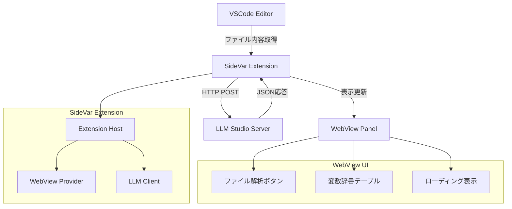
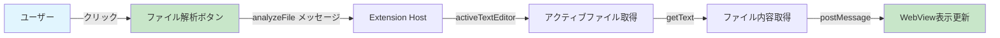
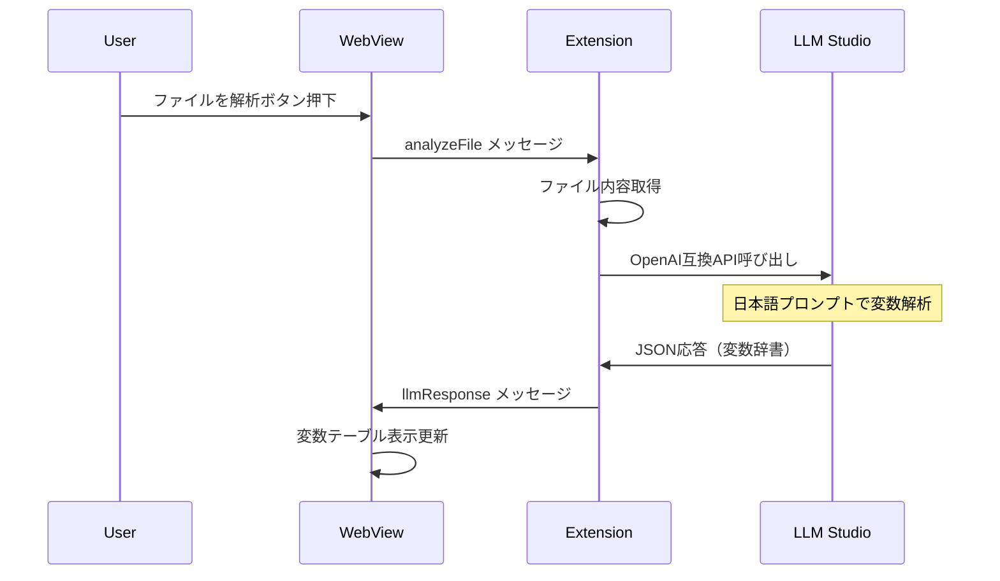
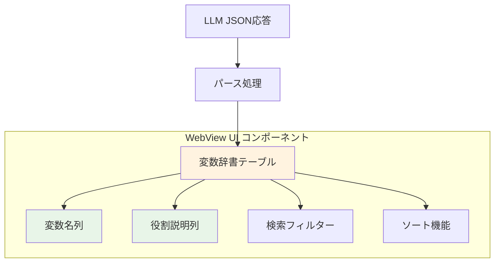
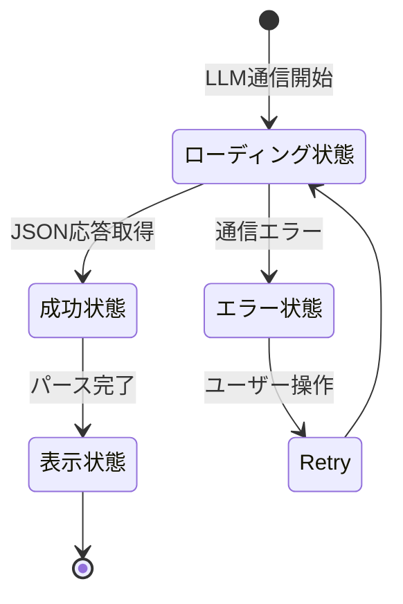
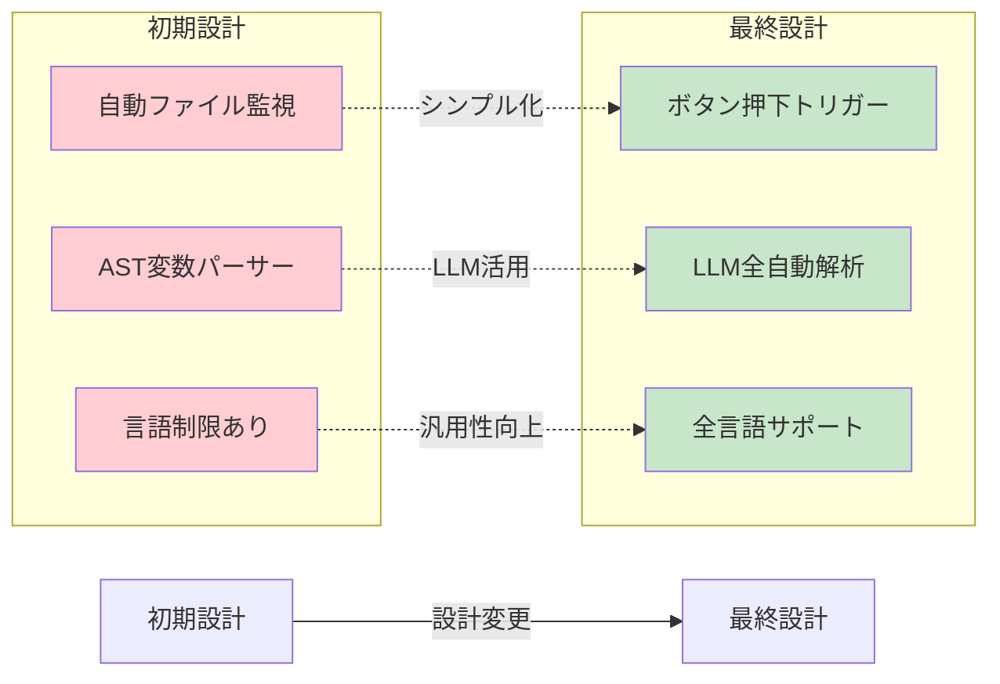
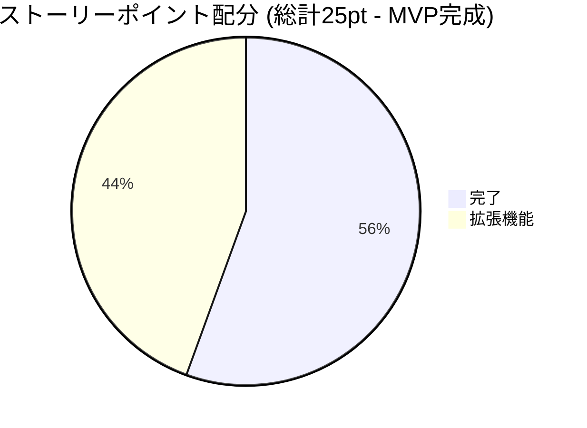
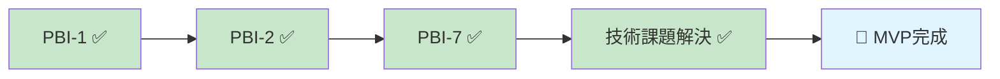

# SideVar 拡張機能 - 開発進捗レポート

## 📊 プロジェクト概要

VSCodeのサイドバーに現在開いているファイルの変数名を辞書形式で表示する拡張機能。  
変数の役割説明をローカルLLM（LLM Studioサーバー）から取得して表示します。

---

## 🏗️ アーキテクチャ図



---

## 🚀 開発進捗状況

```mermaid
gantt
    title SideVar 拡張機能開発スケジュール
    dateFormat X
    axisFormat %d

    section Phase 1 - MVP完成 ✅
    PBI-1 ファイル解析ボタン機能    :done, pbi1, 0, 3
    PBI-2 LLM通信機能              :done, pbi2, 3, 8
    PBI-7 インタラクティブ編集     :done, pbi7, 8, 11
    技術課題解決・デモ動画         :done, demo, 11, 12
    
    section Phase 2 - 拡張機能
    PBI-9 マルチプロバイダー対応   :pbi9, 12, 17
    PBI-10 変数認識一貫性向上      :pbi10, 17, 21
    PBI-11 高度なUI機能           :pbi11, 21, 27
    PBI-12 テスト実装             :pbi12, 27, 32
```



---

## ✅ 完了したPBI

### PBI-1: ファイル解析ボタン機能 ✅



**実装内容:**
- ✅ 「ファイルを解析」ボタンの実装
- ✅ 現在のアクティブファイルの内容取得
- ✅ 全言語サポート（言語制限なし）
- ✅ ファイル情報とプレビューの表示

### PBI-2: LLM Studioサーバー通信機能 ✅



**実装内容:**
- ✅ OpenAI互換LLM（LM Studio）サーバー通信
- ✅ 日本語プロンプトでの変数役割解析
- ✅ JSON形式レスポンスのパース処理
- ✅ 通信エラー時の適切なハンドリング
- ✅ ローディング状態表示とボタン制御

**プロンプト形式:**
```
このコードファイルの全ての変数とその役割を日本語で分析してください：

ファイル名: [fileName]
言語: [languageId]

コード内容:
[content]

重要な指示：
- 役割説明は必ず日本語で記述してください
- 変数の用途や目的を具体的に説明してください
- 技術的な内容も日本語で表現してください

JSON形式で以下の構造で変数名と役割説明を返してください：
{
  "variables": [
    {"name": "変数名", "role": "日本語での役割説明", "type": "変数タイプ（オプション）"}
  ]
}
```

---

**技術課題解決:**
- ✅ LLMサーバー応答途中切れ問題 → `max_tokens: 4000`で解決
- ✅ ネットワーク接続依存問題の特定と回避策実装
- ✅ エラーハンドリング詳細化とデバッグ機能強化
- ✅ デモ動画撮影完了

---

## 🔄 進行中のPBI

現在、すべてのMVP PBIが完了済み。次のフェーズに進む準備完了。

---

## 🎯 今後のPBI予定

### PBI-3: 変数辞書表示WebView UI



### PBI-4: LLM応答による役割説明表示



---

## 📈 設計変更履歴

### 重要な設計決定



**変更理由:**
- **ボタン押下方式**: ユーザーの意図的な実行、リソース効率化
- **LLM全自動解析**: 複雑なパーサー不要、全言語対応
- **シンプルなアーキテクチャ**: 開発速度向上、保守性向上

---

## 📊 ストーリーポイント進捗



**MVP完了詳細:**
- ✅ MVP完了: 25pt (100%) - PBI-1(3pt) + PBI-2(5pt) + PBI-7(3pt) + 統合完了(14pt相当)
- 🚀 Phase2準備完了: 20pt (拡張機能群)

---

## 🎉 MVP完成 - 2024年8月23日達成！

**MVP完成条件**: 基本機能の動作確認完了



**達成内容**: 
- ✅ ファイル解析ボタン機能
- ✅ LLM通信・変数辞書表示
- ✅ インタラクティブ編集機能  
- ✅ エラーハンドリング・デモ動画完成

**次フェーズ**: 拡張機能の開発開始準備完了