# SideVar 拡張機能 - 開発進捗レポート

## 📊 プロジェクト概要

VSCodeのサイドバーに現在開いているファイルの変数名を辞書形式で表示する拡張機能。  
変数の役割説明をローカルLLM（LLM Studioサーバー）から取得して表示します。

---

## 🏗️ アーキテクチャ図

```mermaid
graph TD
    A[VSCode Editor] -->|ファイル内容取得| B[SideVar Extension]
    B -->|HTTP POST| C[LLM Studio Server]
    C -->|JSON応答| B
    B -->|表示更新| D[WebView Panel]
    
    subgraph "SideVar Extension"
        B1[Extension Host]
        B2[WebView Provider]
        B3[LLM Client]
    end
    
    subgraph "WebView UI"
        D1[ファイル解析ボタン]
        D2[変数辞書テーブル]
        D3[ローディング表示]
    end
    
    B --> B1
    B1 --> B2
    B1 --> B3
    D --> D1
    D --> D2
    D --> D3
```



---

## 🚀 開発進捗状況

```mermaid
gantt
    title SideVar 拡張機能開発スケジュール
    dateFormat X
    axisFormat %d

    section Phase 1 - 基盤構築
    PBI-1 ファイル解析ボタン機能    :done, pbi1, 0, 3
    
    section Phase 2 - Core機能
    PBI-2 LLM通信機能              :done, pbi2, 3, 8
    PBI-3 変数辞書表示UI           :active, pbi3, 8, 12
    PBI-4 LLM応答表示機能          :pbi4, 12, 16
    
    section Phase 3 - 拡張機能
    PBI-5 設定管理機能             :pbi5, 16, 19
    PBI-6 エラーハンドリング       :pbi6, 19, 22
    PBI-7 テスト実装              :pbi7, 22, 27
```



---

## ✅ 完了したPBI

### PBI-1: ファイル解析ボタン機能 ✅

```mermaid
flowchart LR
    A[ユーザー] -->|クリック| B[ファイル解析ボタン]
    B -->|analyzeFile メッセージ| C[Extension Host]
    C -->|activeTextEditor| D[アクティブファイル取得]
    D -->|getText| E[ファイル内容取得]
    E -->|postMessage| F[WebView表示更新]
    
    style A fill:#e1f5fe
    style B fill:#c8e6c9
    style F fill:#c8e6c9
```



**実装内容:**
- ✅ 「ファイルを解析」ボタンの実装
- ✅ 現在のアクティブファイルの内容取得
- ✅ 全言語サポート（言語制限なし）
- ✅ ファイル情報とプレビューの表示

### PBI-2: LLM Studioサーバー通信機能 ✅

```mermaid
sequenceDiagram
    participant U as User
    participant W as WebView
    participant E as Extension
    participant L as LLM Studio

    U->>W: ファイルを解析ボタン押下
    W->>E: analyzeFile メッセージ
    E->>E: ファイル内容取得
    E->>L: OpenAI互換API呼び出し
    Note over L: 日本語プロンプトで変数解析
    L->>E: JSON応答（変数辞書）
    E->>W: llmResponse メッセージ
    W->>W: 変数テーブル表示更新
```



**実装内容:**
- ✅ OpenAI互換LLM（LM Studio）サーバー通信
- ✅ 日本語プロンプトでの変数役割解析
- ✅ JSON形式レスポンスのパース処理
- ✅ 通信エラー時の適切なハンドリング
- ✅ ローディング状態表示とボタン制御

**プロンプト形式:**
```
このコードファイルの全ての変数とその役割を日本語で分析してください：

ファイル名: [fileName]
言語: [languageId]

コード内容:
[content]

重要な指示：
- 役割説明は必ず日本語で記述してください
- 変数の用途や目的を具体的に説明してください
- 技術的な内容も日本語で表現してください

JSON形式で以下の構造で変数名と役割説明を返してください：
{
  "variables": [
    {"name": "変数名", "role": "日本語での役割説明", "type": "変数タイプ（オプション）"}
  ]
}
```

---

## 🔄 進行中のPBI

### PBI-3: 変数辞書表示WebView UI 🚧

**注記**: PBI-2の実装でテーブル表示機能も含まれているため、このPBIの大部分は既に完成済み。

---

## 🎯 今後のPBI予定

### PBI-3: 変数辞書表示WebView UI

```mermaid
graph TB
    A[LLM JSON応答] --> B[パース処理]
    B --> C[変数辞書テーブル]
    
    subgraph "WebView UI コンポーネント"
        C --> D[変数名列]
        C --> E[役割説明列]
        C --> F[検索フィルター]
        C --> G[ソート機能]
    end
    
    style C fill:#fff3e0
    style D fill:#e8f5e8
    style E fill:#e8f5e8
```



### PBI-4: LLM応答による役割説明表示

```mermaid
stateDiagram-v2
    [*] --> Loading: LLM通信開始
    Loading --> Success: JSON応答取得
    Loading --> Error: 通信エラー
    Success --> Display: パース完了
    Error --> Retry: ユーザー操作
    Retry --> Loading
    Display --> [*]
    
    Success: 成功状態
    Error: エラー状態
    Loading: ローディング状態
    Display: 表示状態
```



---

## 📈 設計変更履歴

### 重要な設計決定

```mermaid
graph LR
    A[初期設計] -->|設計変更| B[最終設計]
    
    subgraph "初期設計"
        A1[自動ファイル監視]
        A2[AST変数パーサー]
        A3[言語制限あり]
    end
    
    subgraph "最終設計"
        B1[ボタン押下トリガー]
        B2[LLM全自動解析]
        B3[全言語サポート]
    end
    
    A1 -.->|シンプル化| B1
    A2 -.->|LLM活用| B2
    A3 -.->|汎用性向上| B3
    
    style A1 fill:#ffcdd2
    style A2 fill:#ffcdd2
    style A3 fill:#ffcdd2
    style B1 fill:#c8e6c9
    style B2 fill:#c8e6c9
    style B3 fill:#c8e6c9
```



**変更理由:**
- **ボタン押下方式**: ユーザーの意図的な実行、リソース効率化
- **LLM全自動解析**: 複雑なパーサー不要、全言語対応
- **シンプルなアーキテクチャ**: 開発速度向上、保守性向上

---

## 📊 ストーリーポイント進捗

```mermaid
pie title ストーリーポイント配分 (総計30pt)
    "完了" : 8
    "進行中" : 4
    "未着手" : 18
```



**詳細:**
- ✅ 完了: 8pt (27%) - PBI-1(3pt) + PBI-2(5pt)
- 🚧 進行中: 4pt (13%) - PBI-3(4pt, 大部分完成済み)
- ⏳ 未着手: 18pt (60%)

---

## 🎯 MVP完成目標

**MVP完成条件**: PBI-1〜PBI-4の完了時点

```mermaid
graph LR
    A[PBI-1 ✅] --> B[PBI-2 ✅]
    B --> C[PBI-3 🚧]
    C --> D[PBI-4 ⏳]
    D --> E[🎉 MVP完成]
    
    style A fill:#c8e6c9
    style B fill:#c8e6c9
    style C fill:#fff3e0
    style E fill:#e1f5fe
```



**推定完成**: 残り1-2週間（大幅に前倒し！）